# Defish Web Demo

Single-page web client of **Defish**: upload a photo of an aquarium (HEIC from a phone is fine), see every detected fish outlined on the picture, and click a fish to get its diagnosis, the model's confidence, how sure the model is, and care advice. It talks to the Defish API ([`fish-demo_backend`](https://github.com/George2199/fish-demo_backend)); the models behind it are described in [`Defish-ML-train`](https://github.com/George2199/Defish-ML-train). The interface is in Russian, because the application targets Russian-speaking aquarists.

> **Not a veterinary tool.** The classes and advice are hints from a small model.

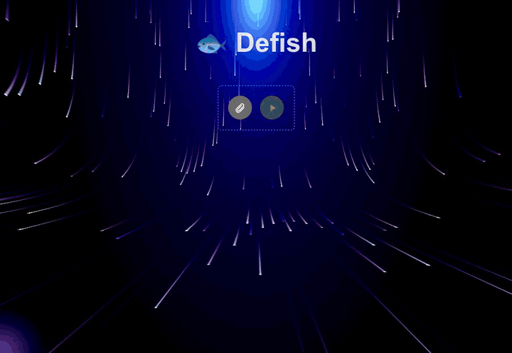

*The whole scenario, recorded on 2026-10-04 against the backend with its **mock** inference service: the boxes sit on the drawn fish, but the classes and confidences are canned, not a model's output. The sample picture is drawn by a script, not a photograph. The yellow ring is a cursor drawn by the recording script.*

## What this project demonstrates

- **A client that behaves when things go wrong.** With the API killed in the middle of a wait, the previous version sent 932 requests in 1.4 s and then blamed the "waiting time"; this one sent 4 and said, after 4.3 s, that the server cannot be reached. A failed analysis used to leave the spinner turning; now the reason is on screen in 0.1 s. [Measurements](docs/measurements/behaviour-old-and-new.txt)
- **HEIC in the browser.** A real HEIC file is converted to JPEG on the page and uploaded as `aquarium.jpg` / `image/jpeg` (read back from the backend); the 3 MB decoder is loaded only for HEIC files, the rest of the page is 100 kB gzip. [Why](docs/design-decisions.md#1-heic-is-converted-in-the-browser)
- **Honest about the model.** The panel shows the model's `uncertain` flag and its three most probable classes, which the previous client dropped.
- **Defects found by running it, then fixed and measured:** a WebGL context per mouse move while dragging the panel (20 per drag, now 0), a blank page without WebGL, uploads over 1 MB refused by the nginx template. [List](docs/design-decisions.md#fixed-while-preparing-these-documents)
- **35 tests in about a second** (Vitest, Testing Library, jsdom). Honest about what it lacks: no real model behind any screenshot, one language, no keyboard access to the boxes. See [Limitations](#limitations).

## Contents

[Idea](#idea) · [Features](#features) · [How it works](#how-it-works) · [Results: measured behaviour](#results-measured-behaviour) · [Quick start](#quick-start) · [Usage examples](#usage-examples) · [Configuration](#configuration) · [What the page asks the API](#what-the-page-asks-the-api) · [Repository layout](#repository-layout) · [Tests and quality](#tests-and-quality) · [Deployment](#deployment) · [Limitations](#limitations) · [Related repositories](#related-repositories) · [License and credits](#license-and-credits)

Further reading in `docs/`:

| File | What is there |
|---|---|
| [docs/architecture.md](docs/architecture.md) | files, one analysis as a sequence, the polling rules as a state diagram, the contract with the API, the result view, the background, build and serving |
| [docs/design-decisions.md](docs/design-decisions.md) | ten decisions with what came before, a table of the defects found and fixed, and what was considered and not done |
| [docs/deployment.md](docs/deployment.md) | build, the nginx template and its checks, the development server, what was verified |
| [docs/measurements/](docs/measurements/) | raw output of the before/after runs, the WebGL check, the HEIC check and the nginx check |
| [docs/capture/](docs/capture/) | the scripts that took the screenshots, the GIFs and the measurements |
| [docs/media/](docs/media/) | screenshots and recordings; [CREDITS.md](docs/media/CREDITS.md) says where each comes from |

## Idea

All analysis happens on the server. The page has three jobs: get a photo to the API in a form it can use, wait for the answer without hammering the server or hanging forever, and show the answer so that a person can tell **which diagnosis belongs to which fish**.

1. **Normalise on the client.** Phones save HEIC, browsers cannot show it and the analysis service cannot read it, so the page converts it once and uses the same JPEG for the thumbnail and the upload.
2. **Bounded waiting.** The analysis is asynchronous, so the page polls; every way the wait can end (result, failure, cancel, repeated errors, timeout) ends in a sentence on screen, not in a spinner.
3. **Boxes you can click.** A box over the photo is a click target; the fish is cut out of the original photo in the browser and shown next to its class, confidence and advice, without another request.
4. **Say when the model is unsure.** A weak guess is shown as a hint, with the alternatives.

## Features

**Choosing a photo**
- Any image file; the thumbnail appears at once and the run button stays disabled until a usable file is ready. HEIC / HEIF is converted to JPEG (quality 0.92) in the browser first. [Why](docs/design-decisions.md#1-heic-is-converted-in-the-browser)

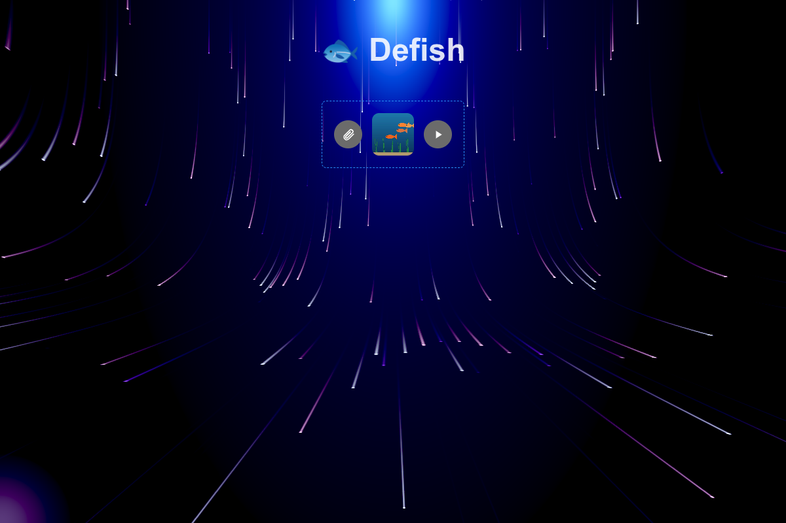

*Photo chosen: thumbnail and the enabled run button.*

**Analysing**
- A ring and a cancel button while the API works. Cancel stops the page's own polling at once, tells the server, and leaves a note. [Code](src/App.jsx), [polling rules](docs/architecture.md#polling)

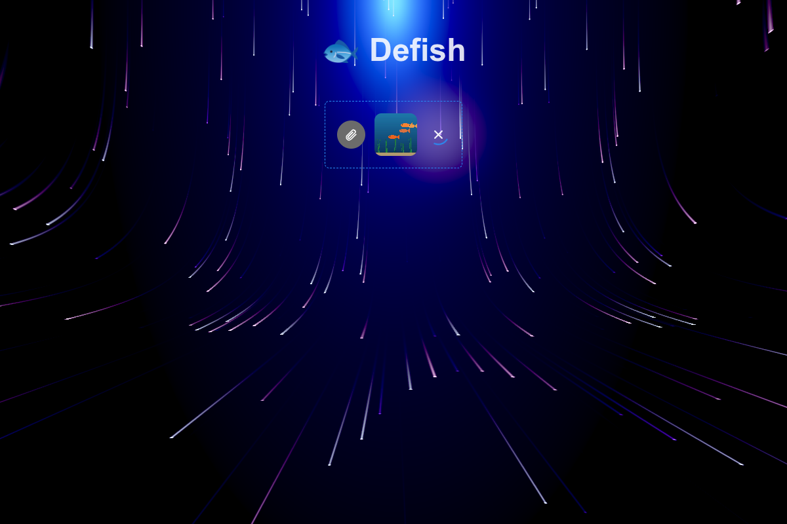

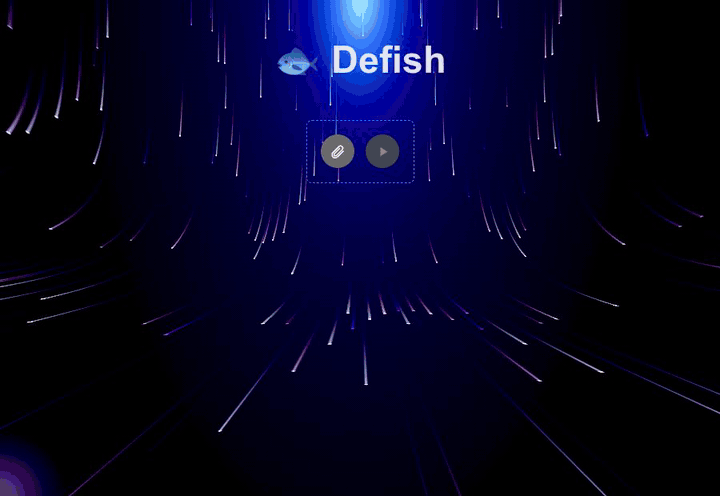

*Analysing, and cancelling.*

**The result**
- The photo with one box per fish, green for a healthy fish and red for any other class, scaled to the displayed size. [How](docs/design-decisions.md#3-boxes-are-an-svg-over-the-photo)

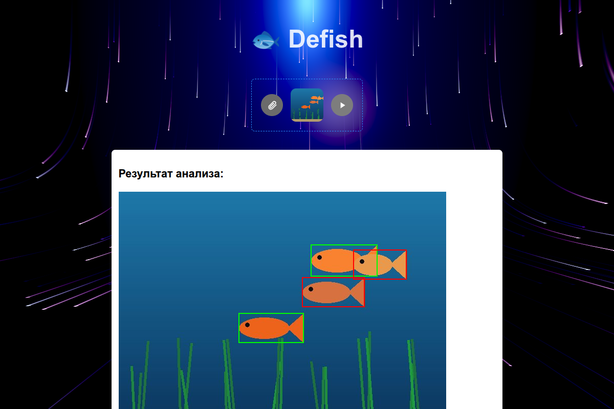

*Boxes on the four fish of the sample picture (canned classes: two healthy, `fin_rot`, `oodiniosis`).*

- A side panel for the clicked fish: the crop, the class (or "Здоров"), the confidence, a note when the model is unsure, the three most probable classes and the advice. Its edge can be dragged (200 to 800 px), and on a phone it takes the whole screen. [How](docs/design-decisions.md#4-the-crop-is-cut-in-the-browser)

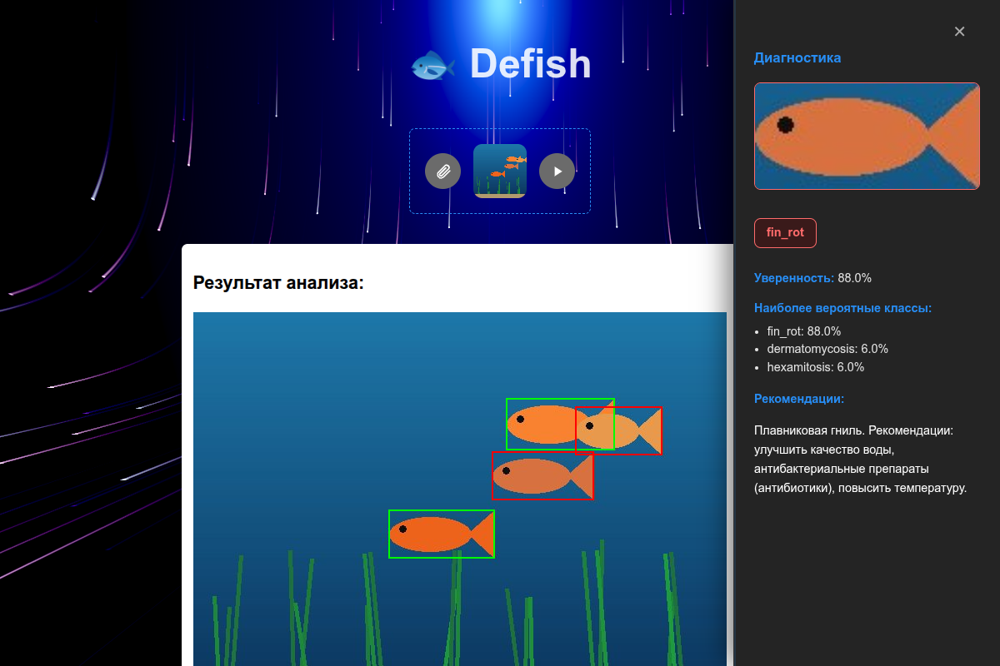

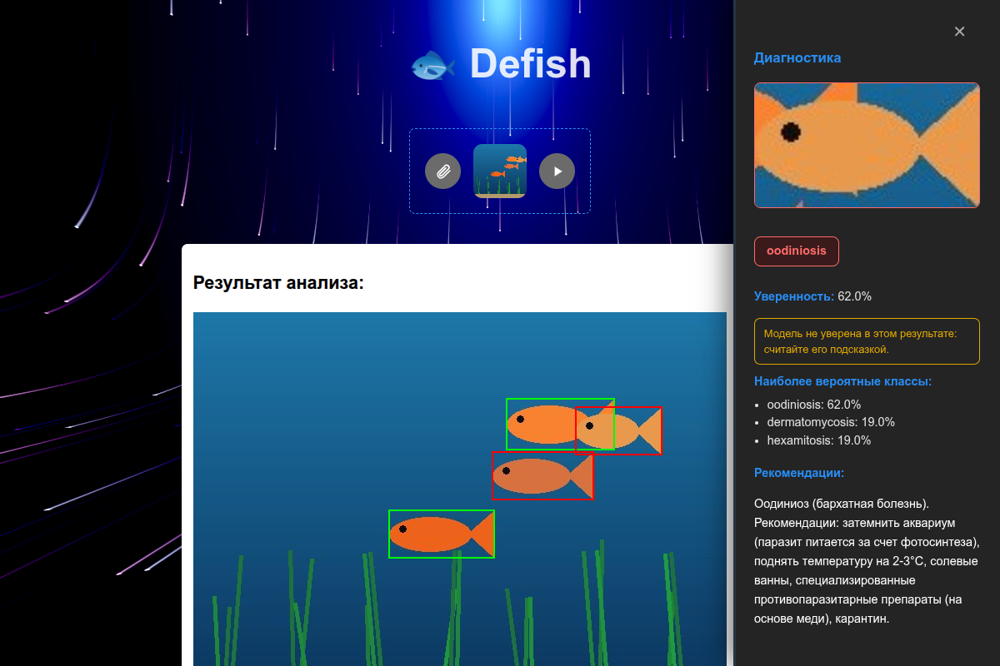

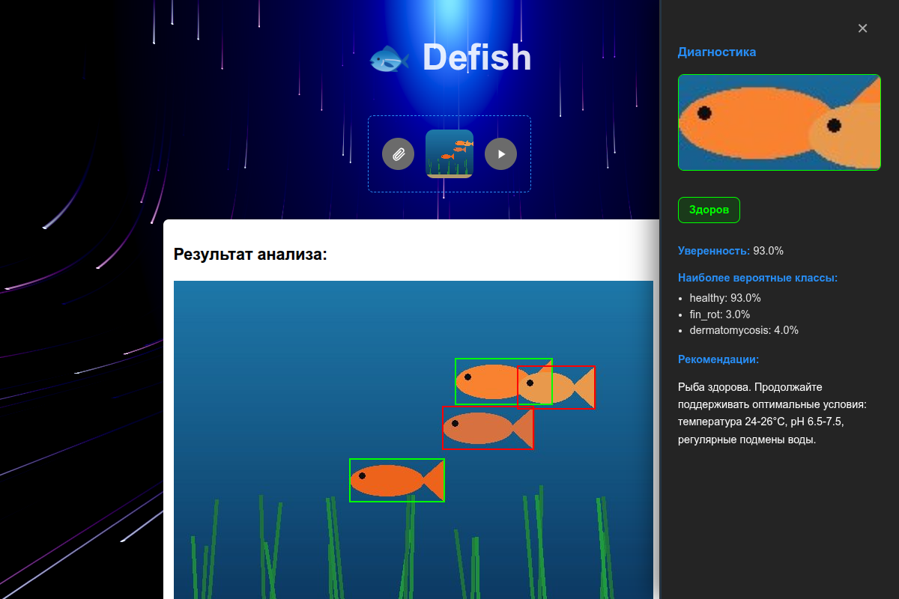

*Three panels: a sick fish, a fish the model is unsure about, a healthy fish. The advice is the backend's fixed Russian text for the class.*

**When something goes wrong**
- Readable messages for a failed analysis, a file over the limit and an unreachable server. [Table](docs/design-decisions.md#5-errors-are-turned-into-sentences)

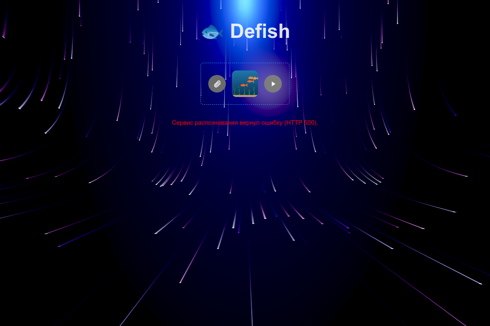

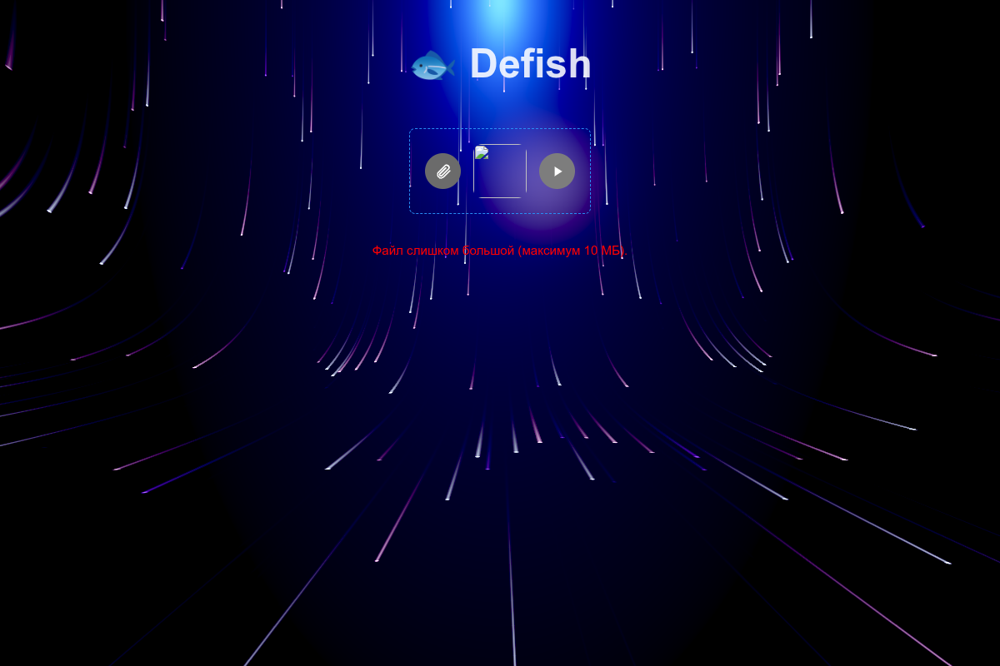

*A failed analysis (the mock answers 500) and a refused upload (an 11 MB file).*

- If the API no longer has the photo, the diagnosis is still shown, as buttons. [Why](docs/design-decisions.md#7-a-result-survives-the-loss-of-its-photo)

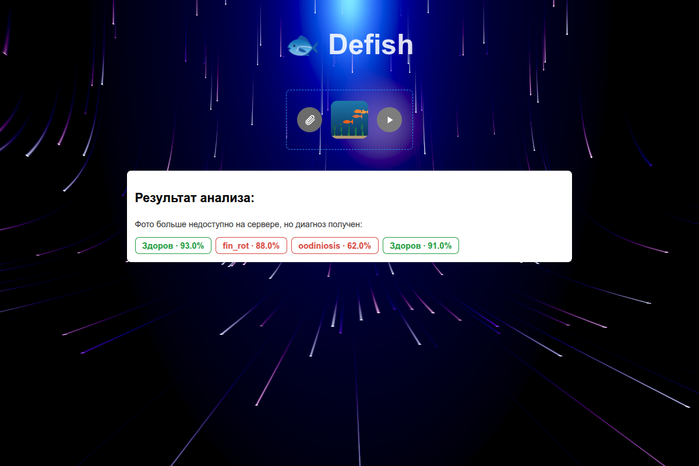

*The API answer with `original_image` set to `null` by the capture script (see [CREDITS](docs/media/CREDITS.md)).*

**Around it**
- A phone-width layout and a light colour scheme:

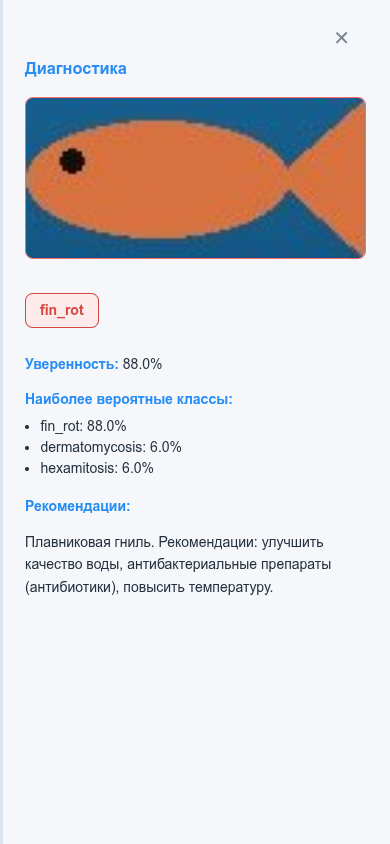

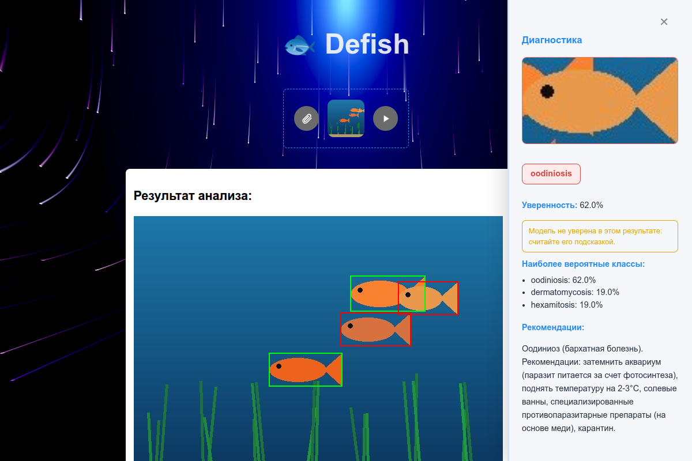

- An animated WebGL background (`ogl`) that follows the pointer; it is created once and the page works without WebGL. [Details](docs/architecture.md#the-background)

## How it works

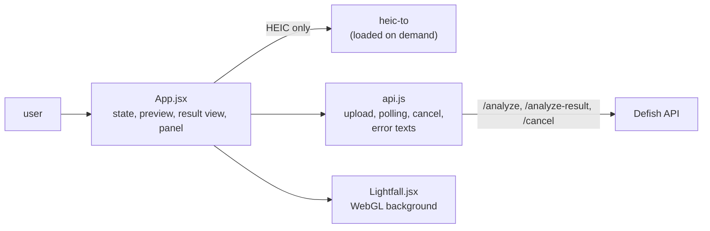

The sequence of one analysis and the polling rules are in [docs/architecture.md](docs/architecture.md). The decisions in one line each:

| Decision | Reason |
|---|---|
| convert HEIC in the browser, on demand | browsers cannot show HEIC and the analysis service cannot read it; 3 MB only for those who need it |
| poll once a second, with a pause after errors, a limit of five failures in a row and about five minutes | every way the wait ends is a message; a down server is not hit in a tight loop |
| boxes as an SVG over the ``, scaled by displayed / natural size | clickable, follows resizing through a `ResizeObserver` |
| crop with a canvas from the photo already in memory | no request, works for cached results |
| translate the backend's short error texts | "Request failed with status code 413" helps nobody |
| show `uncertain` and the top three | a weak guess must not look like a verdict |
| default API address `/api`, an nginx template that proxies it | one origin, no CORS, nothing to configure in the build |

Not done: translations, keyboard access to the boxes, a pre-check of the file size, end-to-end tests in CI ([list](docs/design-decisions.md#considered-and-not-done)).

## Results: measured behaviour

What matters for a client is what it does when the network, the server or the data misbehave. The same six situations were run in headless Chrome against the client as it was (commit `91b9954`) and the current one, with the backend stack and its **mock** inference service. One run each; the photo is a 23 KB synthetic picture. Raw output: [docs/measurements/behaviour-old-and-new.txt](docs/measurements/behaviour-old-and-new.txt).

| Situation | Before | After |
|---|---|---|
| the analysis fails on the server | spinner for the whole 25 s observed, 25 requests, no message | message after 0.1 s: "Сервис распознавания вернул ошибку (HTTP 500)." |
| the API is killed while the page waits | 932 requests in 1.4 s, then "Превышено время ожидания результата" (not true), 454,290 characters in the console | 4 requests, after 4.3 s: "Не удалось связаться с сервером. Проверьте соединение." |
| a file over the limit (11 MB) | "Request failed with status code 413" | "Файл слишком большой (максимум 10 МБ)." |
| cancel pressed during the analysis | no note, one more request after the click | "Анализ отменён.", no more requests |
| `VITE_API_URL` not set | upload to `<origin>/undefined/analyze`, 404 | upload to `<origin>/api/analyze` |
| one normal analysis, console output | 138,393 characters (the whole result with the photo, written on every render) | 158 |
| dragging the panel edge, 20 mouse moves | 20 new WebGL contexts | 0 |
| WebGL disabled in the browser | empty page, `TypeError` | page works, background off |
| side panel on a 390 px screen | 320 px (a strip of the page showed next to it) | 390 px, full width |
| nginx template: `GET /api/`; upload of 2 MB | 502 (port 8000); 413 | 200; 200 |
| `npm audit --omit=dev` | 3 (2 high, 1 moderate) | 0 |

Build: application 308 kB (100 kB gzip), CSS 6.2 kB, HEIC decoder 3.0 MB (734 kB gzip) loaded only for HEIC files. A HEIC file made from the sample picture was uploaded as `aquarium.jpg`, `image/jpeg` ([heic.txt](docs/measurements/heic.txt)).
Nothing here measures speed or the quality of the model: with the mock an analysis takes milliseconds.

## Quick start

Requirements: Node 20.19+ or 22.12+ (the requirement of Vite 7; checked with Node 26.10 and npm 11). Docker with Compose v2 only for the backend.

**1. Tests, lint and build, no backend needed:**

```bash
git clone https://github.com/George2199/fish-demo_frontend.git && cd fish-demo_frontend
npm ci
npm test               # 35 tests, about a second
npm run lint
npm run build          # dist/
```

**2. The page against a real backend stack with the mock inference service** (the screenshots above were taken this way):

```bash
# in a checkout of fish-demo_backend: .env as in its README, then
MOCK_USE_LAYOUT=1 docker compose -f docker-compose.yml -f docs/examples/docker-compose.mock-ml.yml up -d --build

# in this repository
VITE_API_URL=http://127.0.0.1:8001 npm run dev      # http://localhost:5173
```

Upload [docs/examples/aquarium-synthetic.jpg](docs/examples/aquarium-synthetic.jpg): with `MOCK_USE_LAYOUT=1` the mock puts boxes on its four fish. Any other image gets one to three canned boxes. Without the layout flag the boxes of the sample picture are canned too and do not sit on the fish.

**3. With the real inference service.** *Not run for this documentation (no model weights).* Point the backend at it (`ML_SERVER_URL`) and use the same `VITE_API_URL`.

## Usage examples

With the mock, the file name decides what happens (the backend passes it on):

| To see | Choose a file whose name contains | Needs |
|---|---|---|
| the analysing state and cancel | `slow` (the mock waits `MOCK_DELAY_SECONDS`, 8 by default) | rename a copy of the sample, e.g. `slow-aquarium.jpg`: the boxes still sit on the fish because the content is the same |
| a failed analysis | `broken` | any image |
| "no fish found" | `empty` | any image |
| a refused upload | any file over 10 MB | `MAX_UPLOAD_MB` of the backend |
| a HEIC file | `.heic` | a real HEIC file |

The same photo twice is answered at once from the backend's cache (no spinner). The scripts in [docs/capture/](docs/capture/) automate all of the above.

## Configuration

| Variable | When | Meaning | Default | Required |
|---|---|---|---|---|
| `VITE_API_URL` | build (compiled into the page) | base URL of the Defish API, without a trailing slash | `/api` | no |
| `PORT` | `npm run dev` | port of the development server | `5173` | no |

Checked against the code with `grep -rn "import.meta.env\|process.env" src vite.config.js`. Nothing else is read.

## What the page asks the API

`POST /analyze`, `GET /analyze-result/{task_id}`, `POST /cancel/{task_id}`; the fields it uses and what it does with each answer are in [docs/architecture.md](docs/architecture.md#what-the-page-reads-from-the-api). The routes themselves are documented in the [backend](https://github.com/George2199/fish-demo_backend/blob/master/docs/api.md).

## Repository layout

```
src/
  App.jsx          the page: file choice, preview, HEIC, upload / cancel, result view, side panel
  api.js           address, upload, cancel, polling, readable error texts
  Lightfall.jsx    WebGL background
  App.css, index.css, Lightfall.css
  *.test.js(x), test/setup.js     35 tests
nginx/             static files + API proxy template
public/            logo.png, cancel.png
docs/              architecture, design decisions, deployment, measurements/, capture/ (scripts), media/, examples/
index.html, vite.config.js (Vite + Vitest), eslint.config.js, package.json, package-lock.json, LICENSE
```

About 1,400 lines in `src` (CSS and the 370-line WebGL component included), 470 of tests.

## Tests and quality

```bash
npm test         # vitest run
npm run lint     # eslint .
```

| File | Tests | What it covers |
|---|---|---|
| `src/api.test.js` | 22 | polling (result, canceled, the four failure texts, pause after errors, five failures in a row, a good answer resets the count, timeout, abort before and during), error texts per status, the address with and without `VITE_API_URL`, upload and cancel requests |
| `src/App.test.jsx` | 11 | disabled button and thumbnail, HEIC conversion (quality, file name, waits for the conversion), boxes (colours, scaling), cache hit without polling, the panel (crop coordinates, note, top three), closing, dragging the edge with limits, no photo, cancel, failed analysis, 413 |
| `src/Lightfall.test.jsx` | 2 | the background is created once across re-renders; a failing renderer does not break the page |

The API is replaced by mocks (`axios`, and `api.js` in the page tests), WebGL by a fake `ogl`, the HEIC decoder by a stub, layout by stubbed image sizes. Sixteen deliberate regressions (no pause after errors, ignoring `failed`, unscaled boxes, the wrong crop, unclamped panel, a new colours array on every render, and so on) were each caught by a failing test; done by hand, not with a mutation-testing tool.
Lint is clean. `npm audit`: 0 in production dependencies, 2 moderate in the test toolchain (they need a breaking upgrade of Vitest).

Not covered by the tests: real rendering and layout, WebGL, the real HEIC decoder, other browsers. The Playwright scripts in [docs/capture/](docs/capture/) exercise a real Chrome by hand. No CI exists; no workflow has run on GitHub.

## Deployment

A static build served by nginx with `/api/` proxied to the backend on the same host. The template [nginx/fish-demo.conf.template](nginx/fish-demo.conf.template) was tested in a container; it needs `client_max_body_size` above nginx's default 1 MB, which it now sets. TLS is not part of the template. Steps and checks: [docs/deployment.md](docs/deployment.md).

## Limitations

- **Never shown a real model's output or a real phone's photo.** Every screenshot comes from the mock inference service; the boxes are right because the mock knows where the fish were drawn. HEIC was tested with one small file made by a library, not with an iPhone photo.
- **One language.** The interface is Russian only; strings are in the components.
- **Not accessible.** The boxes are SVG rectangles without keyboard focus or labels, and differ by colour only (green / red); the result image has no `alt`.
- **No pre-check of the upload.** A file over the backend's limit is sent first and refused after; the message is clear but the upload time is spent.
- **Polling.** One request per second per open analysis, five minutes at most; after the backend's one-hour result lifetime the same id reads as "processing" again.
- **Cancel does not stop the model.** It stops the page's wait and tells the server; the worker finishes its call.
- **The photo is held in the page as base64** (the API returns it inside the result) and drawn at most 800 x 600 CSS pixels.
- **Large photos are the backend's weak spot** (results can be evicted from its Redis, uploads can fail under many concurrent large files); see its README. The page shows a message in each case but cannot fix them.
- **Dependencies:** 2 moderate advisories remain in the test toolchain.
- **`App.jsx` is still one big component** (the request code was moved out); there is no type checking.
- **Browsers:** only Chrome was run (headless, SwiftShader for WebGL).
- **No CI**, no deployment pipeline in the repository.

**Possible next steps** (suggestions, not planned work): keyboard access and an accessible colour scheme for the boxes; a size check before the upload; translations; running the Playwright scripts in CI; a real-photo and real-model pass.

## Related repositories

**Defish** finds fish in aquarium photos and flags visible signs of disease. It is built from four repositories: the data work and evaluation of the models, the inference service that serves them, an asynchronous API in front of it, and a web client.

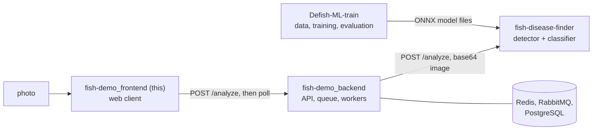

| Repository | Role |
|---|---|
| [`Defish-ML-train`](https://github.com/George2199/Defish-ML-train) | data work, training and leak-free evaluation of the detector and the classifier; produces the model files |
| [`fish-disease-finder`](https://github.com/George2199/fish-disease-finder) | inference service: letterboxed YOLOv8s detector and DINOv2 + linear classifier on ONNX Runtime, with a confidence gate |
| [`fish-demo_backend`](https://github.com/George2199/fish-demo_backend) | API: upload, task queue, workers, result cache, persistence |
| `fish-demo_frontend` (this) | web client: upload, detections drawn over the photo, per-fish diagnosis (Russian interface) |

Shared terms: a **detection** is a box around one fish; a **diagnosis** is one of seven classes (`healthy`, `fin_rot`, `dermatomycosis`, `hexamitosis`, `mycobacteriosis`, `oodiniosis`, `plistophorosis`);
**uncertain** marks a classification whose confidence is below the gate (0.83); **AP50** is average precision at an intersection-over-union of 0.5; a **leak-free split** groups images by source post, so that no tank appears on both sides.

Shared numbers (identical in all four READMEs; from `Defish-ML-train`): the detector reaches AP50 0.66 against 0.55 for the model it replaced, on a leak-free test split of 165 images with 292 fish, under the production pipeline (letterbox to 960 px, confidence 0.25, NMS IoU 0.45).
The classifier reaches accuracy 0.57 and top-3 accuracy 0.84 over 138 expert-checked crops (grouped cross-validation, 95 % interval about +/- 8 points). The gate at 0.83 keeps about half of the crops (49 %) at about 75 % accuracy among those kept; the threshold was chosen on the same out-of-fold predictions, so 0.75 is a target, not an independent measurement.

**Not a veterinary tool.** The output is a hint, not a diagnosis.

## License and credits

Developed together with [@powelitelploti](https://github.com/powelitelploti).

License: MIT, see LICENSE.
Author: George Denisov · [GitHub](https://github.com/George2199) · [Telegram](https://t.me/denisov_george)
