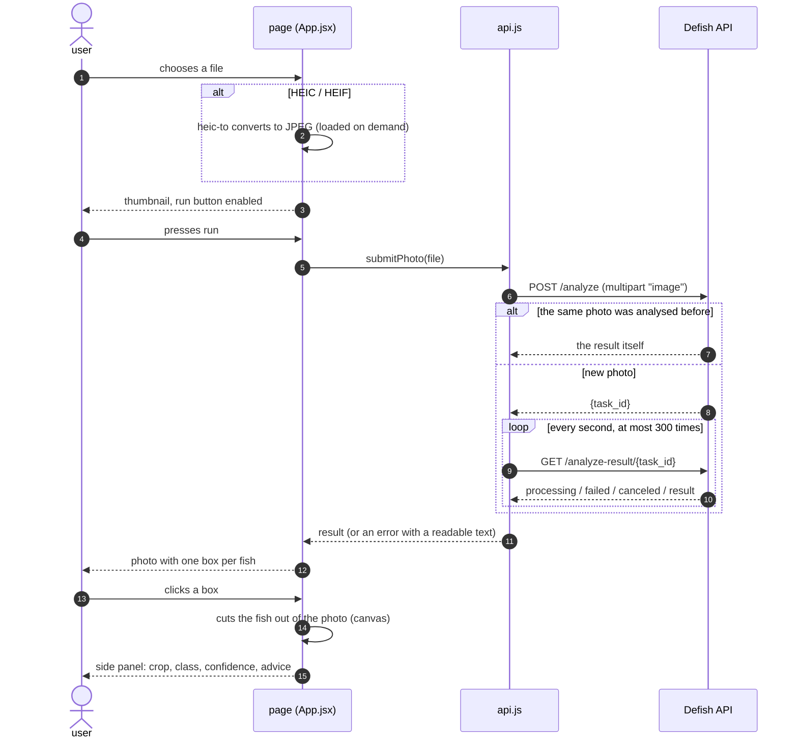
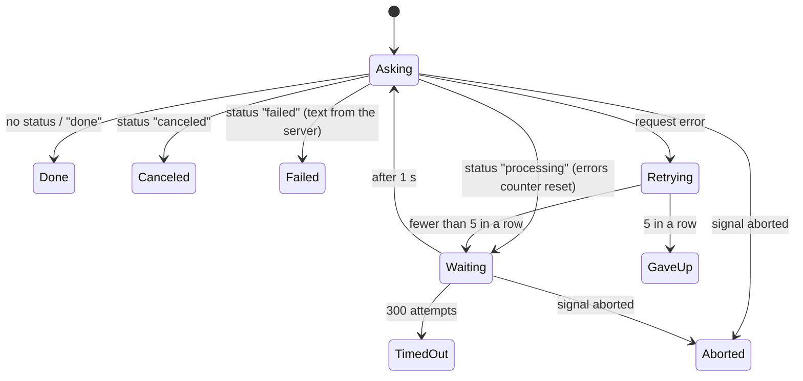
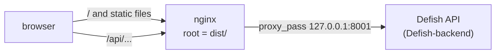

# Architecture

How the page is built, what it asks the API for and how it reacts. Facts were read from the code and, where it says *measured*, observed in headless Chrome against the backend stack with the **mock** inference service
([measurements/](measurements/), scripts in [capture/](capture/)).

Contents: [Files](#files) · [One analysis](#one-analysis) · [Polling](#polling) · [What the page reads from the API](#what-the-page-reads-from-the-api) · [The result view](#the-result-view) · [The background](#the-background) · [Build and serving](#build-and-serving)

## Files

| File | Role |
|---|---|
| `src/App.jsx` | the whole page: file choice and preview, HEIC conversion, upload/cancel, result view, side panel |
| `src/api.js` | everything that talks to the API: address, upload, cancel, the polling loop, readable error texts |
| `src/Lightfall.jsx` | the animated WebGL background (`ogl`), a self-contained component |
| `src/App.css`, `src/index.css`, `src/Lightfall.css` | styles; dark by default, a light variant through `prefers-color-scheme` |
| `src/*.test.*`, `src/test/setup.js` | 35 tests (Vitest, Testing Library, jsdom) |
| `nginx/fish-demo.conf.template` | static files plus a proxy to the API on the same origin |

## One analysis

The page keeps one `AbortController` for the running request. A new upload, the cancel button and leaving the page abort it; an aborted request shows no error.

## Polling

Rules, all in `pollResult` ([src/api.js](../src/api.js)): one request per second; a pause also after an error (the previous client had none and sent 932 requests in 1.4 s to an API that was down, *measured*, [behaviour](measurements/behaviour-old-and-new.txt));
five failed requests in a row end the wait with a message chosen by the kind of error; a good answer resets the count; about five minutes in total. Every request has a 30 s timeout, the upload 2 minutes.

## What the page reads from the API

Routes: `POST /analyze`, `GET /analyze-result/{task_id}`, `POST /cancel/{task_id}`. Reference: the backend's [docs/api.md](https://github.com/George2199/Defish-backend/blob/master/docs/api.md). The address is `VITE_API_URL`, `/api` when it is not set.

| Answer | What the page does |
|---|---|
| `{task_id, cached: false, ...}` | starts polling |
| an object with `id` and `diagnosis` | a cache hit: shows it at once |
| `{status: "processing"}` | waits |
| `{status: "failed", message}` | stops; `message` is one of the backend's four short texts and is translated (`ML service unavailable`, `timed out`, `returned HTTP n`, anything else) |
| `{status: "canceled"}` | stops, shows nothing |
| 413 | "file too large (max N MB)", N parsed from the backend's `detail` |
| 422 / 5xx / no answer | a generic text for each |
| the result | uses `original_image`, `detections[]` and, per detection, `x_min..y_max`, `classification_class`, `classification_confidence`, `recommendations`, `uncertain`, `top3` |

Not used: `diagnosis`, `confidence` and `recommendations` of the whole photo, `image_width/height`, `detection_confidence`. The summary texts are left to the per-fish panel.

## The result view

- **Boxes.** The photo is shown at most 800 x 600 CSS pixels; an SVG of the displayed size lies over it. Every box is the detection scaled by displayed size / natural size, read from the image after it loads and again by a `ResizeObserver`. Green (`lime`) for `healthy`, red for any other class.
- **Crop.** Clicking a box draws that rectangle of the original photo (natural pixels) into a canvas and shows it in the panel; nothing is requested from the server.
- **Panel.** Class (the code of the class, or "Healthy" for `healthy`), confidence, a note when the model flagged the result as `uncertain`, the three most probable classes, and the advice for that fish. Its edge can be dragged between 200 and 800 px; on a phone (up to 480 px) it takes the whole width.
- **Without the photo.** The API keeps a photo for an hour; if it is gone the answer has `original_image: null`. The page then lists the detections as buttons (class and confidence) under a note, and the panel opens without a crop.

## The background

`Lightfall` draws falling light streaks with a fragment shader and reacts to the pointer. It creates its WebGL renderer in an effect that depends on its props, so the props must keep their identity: the colours array is a module constant. Before this was fixed every state change of the page, including every mouse move while dragging the panel, created a new WebGL context (20 for a 20-move drag, 29 in one short session, *measured*; Chrome documents a limit of 16 live contexts and drops the oldest, not tested here). If WebGL is unavailable the effect now logs a warning and the page works without the background; before, the page stayed empty with a `TypeError`
([webgl.txt](measurements/webgl.txt)).

## Build and serving

`npm run build` produces `dist/`: `index.html`, one CSS file (6.2 kB), the application (308 kB, 100 kB gzip) and a separate chunk with the HEIC decoder (3.0 MB, 734 kB gzip) that is fetched only when a HEIC file is chosen. `VITE_API_URL` is read **at build time**.

With the nginx template the page and the API share one origin, so the build uses the default `/api` and the browser needs no CORS. Details and the checks of the template: [deployment.md](deployment.md).
